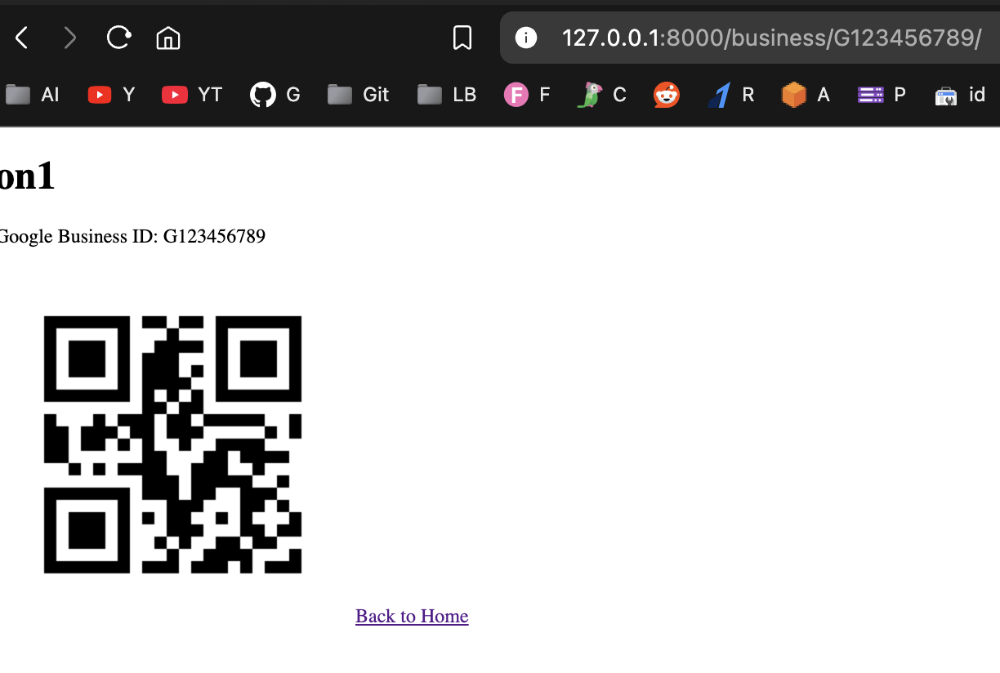

# 🎉 Business Review App: Where Reviews Go to Party! 🎉

Welcome to the **Business Review App**, the most exhilarating place on the internet to **review** your favorite businesses—because what else are you gonna do with your free time? Watch paint dry?

## 🚀 Features

- **Dazzling Dashboards**: Get a visual feast of your local businesses! You can see their **QR codes** (because who doesn't love a good QR code?), ratings, and even their secrets (just kidding, they keep those hidden).

- **Admin Magic**: Easily add, update, or delete businesses from our exclusive **admin panel**! Feel like a business god and control the fates of local establishments. *Mwahaha!*

- **Dynamic QR Code Generation**: Say goodbye to boring static codes! Our app generates QR codes on the fly. Impress your friends at parties—“Did you see that QR code? It’s dynamically generated!”

- **Responsive Design**: Looks great on all devices. Whether you’re on a phone, tablet, or a toaster with a browser, you can enjoy our app.

## 📦 Getting Started

1. **Clone the repo**:
   ```bash
   git clone https://github.com/sachnaror/review_system.git
   pip install -r requirements.txt

📜 How to Use

	1.	Add Business: Hit that “Add Business” button like you’re adding toppings to your pizza! Fill in the details, and boom—your business is now on the map (and the QR code is generated).
	2.	View Reviews: Click on a business to see what others have to say. Spoiler alert: most of it is either “They have great coffee!” or “Their Wi-Fi password is awful!”
	3.	Review Away: Leave your thoughts and unleash your inner critic. Will it be a Michelin star review or a trip advisor nightmare?

🤖 Tech Stack

	•	Django: The framework that makes our dreams come true (and helps us avoid writing too much boilerplate code).
	•	Python: The language of wizards, sorcerers, and well… you!
	•	HTML/CSS: For those artsy folks who think they can style like Michelangelo.

😅 FAQ

	•	Q: Can I really review businesses?
A: Yes, and you can also submit fake reviews, but we won’t tell anyone… wink.
	•	Q: What if I have a business I want to add?
A: Add it! We’re open 24/7 (unless the server crashes, then we’re closed).
	•	Q: How do I contact support?
A: Just shout “Help!” really loudly and hope for the best. Or you know, open an issue on GitHub.

🎈 Contributing

Want to contribute? Great! Fork the repo, make your changes, and send us a pull request. Just remember: “With great power comes great responsibility.” (And maybe some bad jokes.)

📜 License

This project is licensed under the MIT License - feel free to do what you want with it, but just don’t sue us if things go wrong. Deal?

Happy reviewing! 🎉🎉

```
├── review_system/
│   ├── env.py
│   ├── requirements.txt
│   ├── db.sqlite3
│   ├── README.md
│   ├── manage.py
│   ├── review_system/
│   │   ├── settings.py
│   │   ├── urls.py
│   │   └── wsgi.py
│   ├── reviews/
│   │   ├── models.py
│   │   ├── serializers.py
│   │   ├── apps.py
│   │   ├── admin.py
│   │   ├── utils.py
│   │   ├── tests.py
│   │   ├── urls.py
│   │   └── views.py
│   │   └── qr_codes/
│   │   ├── static/
│   │   │   ├── css/
│   │   │   │   └── styles.css
│   │   │   └── images/
│   │   │   └── js/
│   │   ├── templates/
│   │   │   ├── reviews/
│   │   │   │   ├── feedback.html
│   │   │   │   ├── home.html
│   │   │   │   ├── business_qr.html
│   │   │   │   ├── review_stars.html
│   │   │   │   └── business_detail.html
│   ├── media/
│   │   ├── qrcodes/
│   │   │   ├── test_business_qr.png
│   │   │   ├── ta_qr.png
│   │   │   └── test_business_qr_G96g41C.png
│   │   ├── qr_codes/
│   │   │   ├── qr_code_on1.png
│   │   │   └── qr_code_two.png


```

```

